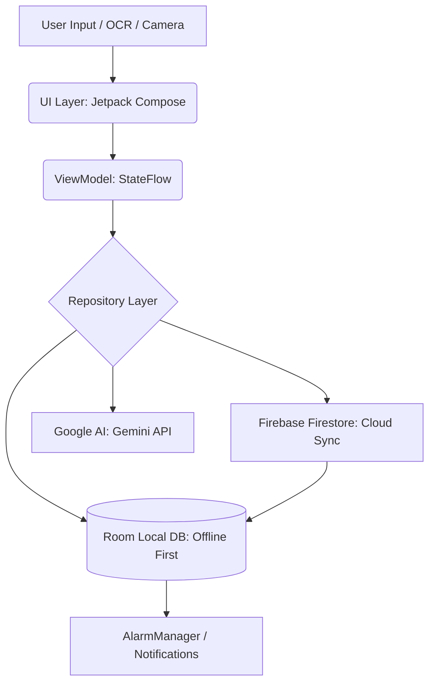

# MedicineReminder 💊

**MedicineReminder** is a modern, AI-augmented Android application designed to solve the critical problem of medication non-adherence. Built with a focus on reliability, security, and intelligence, it transforms a simple reminder into a comprehensive health companion.

---

## 🚀 Key Features

### 🧠 AI-Powered Intelligence
- **OCR Prescription Scanner**: Instantly extract medicine name, dosage, and frequency from prescription photos or medicine bottles using Google ML Kit.
- **AI Health Assistant**: Integrated with **Google Gemini 2.5 Pro** to provide professional medical insights, side-effect information, and health tips.
- **Smart Interaction Alerts**: Automatically detects and warns about potential drug-drug interactions between your current medications.

### ⏰ Precision Reminders
- **Reliable Scheduling**: Uses Android's `AlarmManager` for exact, time-critical triggers and `WorkManager` for background resilience.
- **Interactive Notifications**: Mark doses as "Taken," "Snoozed," or "Skipped" directly from the lock screen without opening the app.
- **Daily Rescheduling**: Automatic daily background updates ensure your schedule is always synced and ready.

### 📊 Health Analytics
- **Visual Progress**: Dynamic bar and line charts powered by the **Vico library** to track your adherence score over time.
- **Dose History**: Comprehensive logging of taken vs. missed doses to help you and your doctor identify health patterns.

### 🔒 Security & Privacy
- **Biometric Protection**: Secure your sensitive medical data with Fingerprint or Face ID using the Android Biometric API.
- **App Lock**: Dual-layer security with a custom PIN-based entry system.

### 🎨 Modern UI/UX
- **Material 3 Design**: Clean, professional, and accessible interface.
- **Dynamic Theming**: Supports Android 12+ **Dynamic Colors** (Monet) and seamless Dark/Light mode transitions.
- **Interactive Home Screen**: Features an infinite auto-scrolling carousel and a dynamic "Upcoming Dose" hero card.

---

## 🏗️ Architecture & Data Flow

The project follows **Clean Architecture** principles and the **MVVM (Model-View-ViewModel)** design pattern.

### Data Flow & Architecture
The app uses a reactive, offline-first data flow.

**Visual Representation (Visible on GitHub):**


**Text-Based Flow (Visible Everywhere):**
```text
[Camera/OCR] ➔ [Jetpack Compose UI] ➔ [ViewModels]
                                          ↓
                                 [Repository Layer]
                                   ↙      ↓      ↘
                [Room Database]  ➔ [Firebase]  ➔ [Google AI]
                      ↓
              [Notifications]
```

### Tech Stack
- **Language**: Kotlin
- **UI**: Jetpack Compose (Declarative UI)
- **Database**: Room (Local Persistence)
- **Backend**: Firebase (Auth, Firestore, Storage)
- **AI/ML**: Google Gemini Pro, ML Kit (OCR)
- **Background Tasks**: WorkManager
- **Async**: Kotlin Coroutines & Flow
- **Charts**: Vico

---

## 🛠️ Setup Instructions

1. **Clone the Repository**:
   ```bash
   git clone https://github.com/yourusername/MedicineReminder.git
   ```
2. **Firebase Configuration**:
   - Add your `google-services.json` to the `app/` directory.
3. **API Keys**:
   - Go to [Google AI Studio](https://aistudio.google.com/) and generate an API key.
   - Insert your key into `AIRepository.kt` or `local.properties`.
4. **Build & Run**:
   - Use Android Studio Ladybug (or later) to sync Gradle and run on a device with API level 24+.

---

## 📈 Roadmap
- [ ] WearOS (Smartwatch) integration for wrist reminders.
- [ ] Family Dashboard for remote monitoring of elderly patients.
- [ ] Pharmacy API integration for automatic prescription refills.

---

## 📄 License
This project is licensed under the MIT License - see the LICENSE file for details.

---

*Disclaimer: This app is for informational purposes only. Please consult a qualified healthcare professional before making any medical decisions.*
